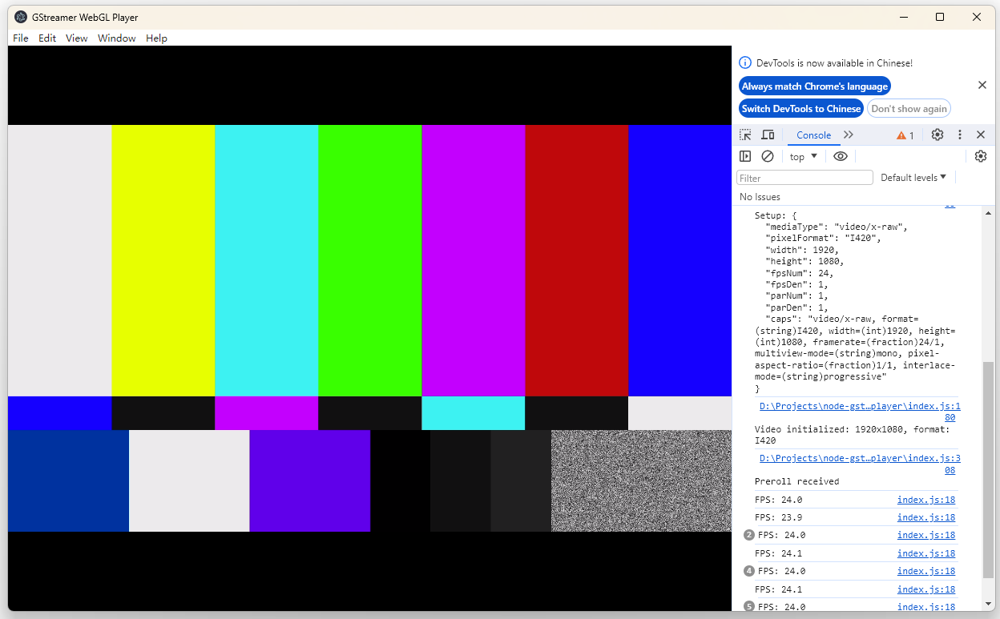

# node-gst-player

A Node.js addon for playing media using GStreamer with WebGL rendering in Electron.

## Features

- **I420 format support** - YUV420 planar format for efficient video rendering
- **Hardware-accelerated rendering** - WebGL2/WebGL GPU-based rendering
- **Single-copy buffer handling** - Efficient buffer transfer using GStreamer buffer references
- **Automatic window event handling** - Pause/resume on window minimize/restore
- **Clean resource management** - Proper cleanup to prevent crashes during hot reload

## Installation

```bash
npm install
npm run build
```

## Requirements

- Node.js
- Electron (for example app)
- GStreamer 1.14.4+ development libraries
- Windows: GStreamer development files must be in system PATH

## Running the Example

```bash
cd example
npm install
npm start
```

The example uses Electron and displays a test pattern at 1920x1080 resolution at 24 FPS.



## Usage

### WebGLGstPlayer (Recommended)

The `WebGLGstPlayer` class provides a simple API for rendering video to a WebGL canvas.

```javascript
const { WebGLGstPlayer } = require('node-gst-player');

const canvas = document.getElementById('gl-canvas');
const player = new WebGLGstPlayer(canvas);

// Start playback with I420 format
player.start('videotestsrc ! video/x-raw,width=1920,height=1080,format=I420 ! appsink name=sink');

// Get frame count for FPS calculation
const fps = player.getFrameCount() / elapsedSeconds;
```

### GstPlayer (Low-level API)

For more control, use the `GstPlayer` class directly.

```javascript
const { GstPlayer } = require('node-gst-player');

const player = new GstPlayer();

// Parse pipeline
player.parseLaunch('videotestsrc ! video/x-raw,width=1920,height=1080,format=I420 ! appsink name=sink');

// Add callback for app sink
player.addAppSinkCallback('sink', (event, ...args) => {
  switch (event) {
    case player.AppSinkSetup:
      const [info] = args;
      console.log('Video initialized:', info.width, 'x', info.height, 'format:', info.pixelFormat);
      break;

    case player.AppSinkNewPreroll:
      console.log('Preroll received');
      break;

    case player.AppSinkNewSample:
      const buffer = args[0]; // Uint8Array with frame data
      // Process frame data (I420 format: Y plane + U plane + V plane)
      break;

    case player.AppSinkEos:
      console.log('End of stream');
      break;
  }
});

// Set state to playing
player.setState(player.GST_STATE_PLAYING);
```

## API

### WebGLGstPlayer

#### Constructor

```javascript
new WebGLGstPlayer(canvas)
```

- `canvas` - HTML canvas element for rendering

#### Methods

- `start(pipelineDesc)` - Start playback with GStreamer pipeline description
- `stop()` - Stop playback by sending EOS event
- `getFrameCount()` - Get total frames rendered

### GstPlayer

#### Methods

- `parseLaunch(pipelineString)` - Create and parse a GStreamer pipeline
- `addAppSinkCallback(elementName, callback)` - Add callback to app sink element
- `addCapsProbe(elementName, padName, callback)` - Add probe to element pad for caps changes
- `setState(state)` - Set pipeline state (GST_STATE_NULL, GST_STATE_READY, GST_STATE_PAUSED, GST_STATE_PLAYING)
- `sendEos()` - Send end-of-stream event

#### Constants

**States:**
- `GST_STATE_VOID_PENDING` - No pending state
- `GST_STATE_NULL` - Null state (pipeline not created)
- `GST_STATE_READY` - Ready state (pipeline created but not running)
- `GST_STATE_PAUSED` - Paused state (pipeline paused, buffers accumulating)
- `GST_STATE_PLAYING` - Playing state (pipeline actively processing)

**Events:**
- `AppSinkSetup` - Video format information available
- `AppSinkNewPreroll` - First sample available
- `AppSinkNewSample` - New frame available
- `AppSinkEos` - End of stream

## Video Format

Currently supported: **I420** (YUV420 planar)

### I420 Format Layout

The I420 format stores YUV data in three separate planes:
- **Y plane**: Full resolution (width × height bytes)
- **U plane**: Quarter resolution (width/2 × height/2 bytes)
- **V plane**: Quarter resolution (width/2 × height/2 bytes)

Total size: `width × height × 1.5` bytes

## Architecture

### Buffer Handling

The addon uses an efficient single-copy approach:

1. GStreamer produces frames in its own thread
2. Buffer reference is held using `gst_buffer_ref()`
3. Thread-safe function (`NonBlockingCall`) transfers data to JavaScript thread
4. Data is copied to V8 Buffer using `Napi::Buffer::NewOrCopy()`
5. Buffer reference is released with `gst_buffer_unref()`

This minimizes memory copies while maintaining thread safety.

### Window Event Handling

The `WebGLGstPlayer` automatically handles Electron window events using `@electron/remote`:
- **Window minimize** → Pauses playback (GST_STATE_PAUSED) to prevent memory buildup
- **Window restore** → Resumes playback (GST_STATE_PLAYING)
- **Window maximize** → Resumes playback (GST_STATE_PLAYING)

## Building

```bash
npm run build
```

This runs `node-gyp configure` and `node-gyp rebuild` to compile the native addon.

## GStreamer Pipeline Examples

### Test Pattern
```
videotestsrc ! video/x-raw,width=1920,height=1080,framerate=30/1,format=I420 ! appsink name=sink
```

### With Queue (Recommended for stability)
```
videotestsrc ! queue ! video/x-raw,width=1920,height=1080,framerate=24/1,format=I420 ! appsink name=sink
```

### MP4 File Playback
```
filesrc location=video.mp4 ! decodebin ! videoconvert ! video/x-raw,format=I420 ! appsink name=sink
```

### RTSP Stream
```
rtspsrc location=rtsp://camera-ip/stream ! rtph264depay ! h264parse ! avdec_h264 ! videoconvert ! video/x-raw,format=I420 ! appsink name=sink
```

### USB Camera (Linux)
```
v4l2src ! video/x-raw,width=1920,height=1080,format=I420,framerate=30/1 ! appsink name=sink
```

## Project Structure

```
node-gst-player/
├── src/
│   ├── GstPlayer.h       # Native addon header
│   ├── GstPlayer.cpp     # Native addon implementation
│   └── module.cpp       # Node.js module entry point
├── index.js            # JavaScript wrapper (exports GstPlayer and WebGLGstPlayer)
├── example/            # Electron example application
│   ├── index.html      # Example HTML with canvas
│   ├── index.js       # Example JavaScript
│   └── main.js       # Electron main process
├── binding.gyp        # node-gyp build configuration
└── package.json       # Package configuration
```

## License

MIT
